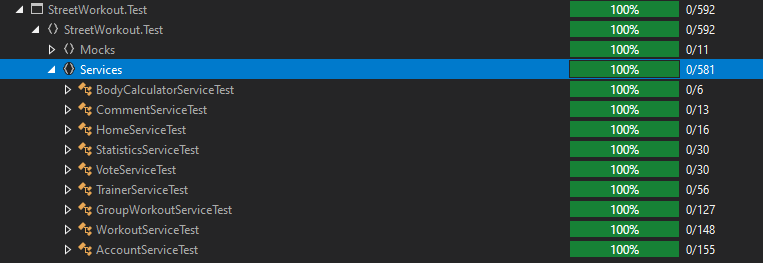

#  Street-Workout
ASP .NET Core MVC application designed to help people who are active in all sports.

# Project Introduction
StreetWorkout is a ASP.NET Core MVC project I builded in course at SoftUni (April-June 2021). <br /> The website is application for people who are active in the sports.

# Built With
* ASP.NET Core 5 MVC
* ASP.NET CORE view components
* ASP.NET Core areas
* MSSQL Server
* Entity Framework Core
* Auto-Mapper
* AJAX
* jQuery
* Moq
* XUnit
* Shouldly
* [MyTested.AspNetCore.Mvc](https://github.com/ivaylokenov/MyTested.AspNetCore.Mvc)
* Bootstrap
* Font Awesome Icons
* TinyMCE

# Functionality
* Users Registration.
* Ability to View, Create, Read Publications.
* Ability to Comment, like, save and print publications.
* Ability to Edit and Delete publications (Only for the creator).
* Ability to Follow users, as well as be followed by other users.
* Ability to Filter publications by category and search by Title.
* Chat room allowing users to exchange messages.
* Cache Data 'Memory Cache' (see below) to reduce database queries.
* Interactive, flexible UX (User Experience)
* Used Cache in home page
* Page about Supplements with Create, Edit and Delete actions only for administrator. 

# Quick Start && Implementation

* Administrator User - seeded by default and you can use it without making new registration if you want.
```javascript
UserName = Vasilkovski
Password = vasko123
```

* Cache - The latest workouts/users on the home page are cached with the purpose of reducing requests to the database.

```javascript
var latestWorkouts = this.cache.Get<IEnumerable<WorkoutServiceModel>>(LatestWorkoutsCacheKey);
if (latestWorkouts == null)
{
    latestWorkouts = this.homeService.Workouts();

    var cacheOptions = new MemoryCacheEntryOptions()
        .SetAbsoluteExpiration(TimeSpan.FromMinutes(10));

    this.cache.Set(LatestWorkoutsCacheKey, latestWorkouts, cacheOptions);
}
```

# Database Diagram



# Test

### Libraries used for testing:

* XUnit
* Moq
* [MyTested.AspNetCore.Mvc](https://github.com/ivaylokenov/MyTested.AspNetCore.Mvc)
* Shouldly

---

* Services Test Coverage 100%


* Controllers Test Coverage 100%


# Steps to create a similar web application from scratch:

1. Create and clean project.
2. Introduced data project and configure Database in it.
3. Extend default IdentityUser.
4. Implemented lazy kit theme.
5. Extend register form, create user role, gender and add validations.
6. Finished account complete functionality.
7. Implement service layer.
8. Separation of the application by projects.
9. Implemented a account page in which user data is visualized.
10. Implemented Account page and if user account is completed show user data or it is not completed, show account complete form.
11. Implemented a Trainers page in which all trainers will be visualized.
12. Implemented training creation.
13. Implemented group workouts, visualization and creation.
14. Implemented body calculator, which calculates how many calories you need per day.
15. Introduced Administartor area.
16. Cover services with unit tests.
17. Cover Controlles with integration tests.
18. Implemented page for supplements with Create, Edit and Delete actions.
19. Removed 'this' from all views.

Potential Tasks:
- Use Moment.js when visualized dates.
- Add documentation about project architecture.
- Add documentation about best practices and high quality code.
- Implement a chat where all registered users can exchange messages.
- Implement Administration on SupplementCategories, Sports, BodyParts, Goals ...
- Fix Footer.
- Use TempData for success message after added new entity.
- Impelement searching in supplements.
- Add latest supplements in home page.
- Test Routing and Logic of the controllers.


# Note
ConnectionStrings:
* MacOs - Data Source=127.0.0.1,1433;Initial Catalog=StreetWorkout;User ID=sa;Password=<YourStrong@Passw0rd>;
* Windows - Server=.;Database=StreetWorkout;Trusted_Connection=True;MultipleActiveResultSets=true