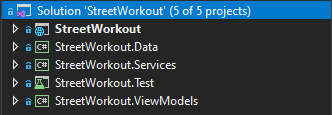
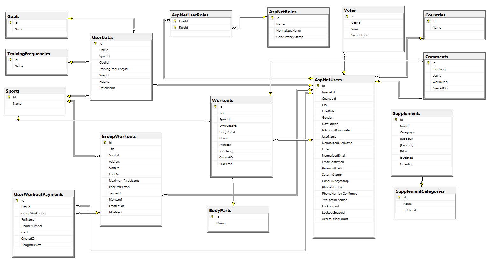
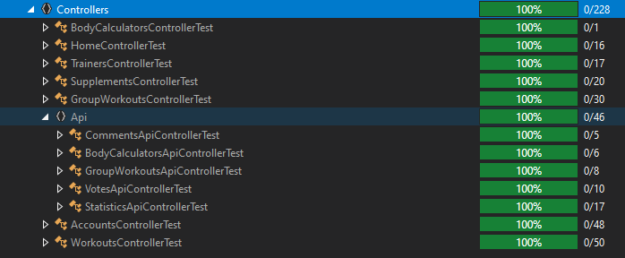
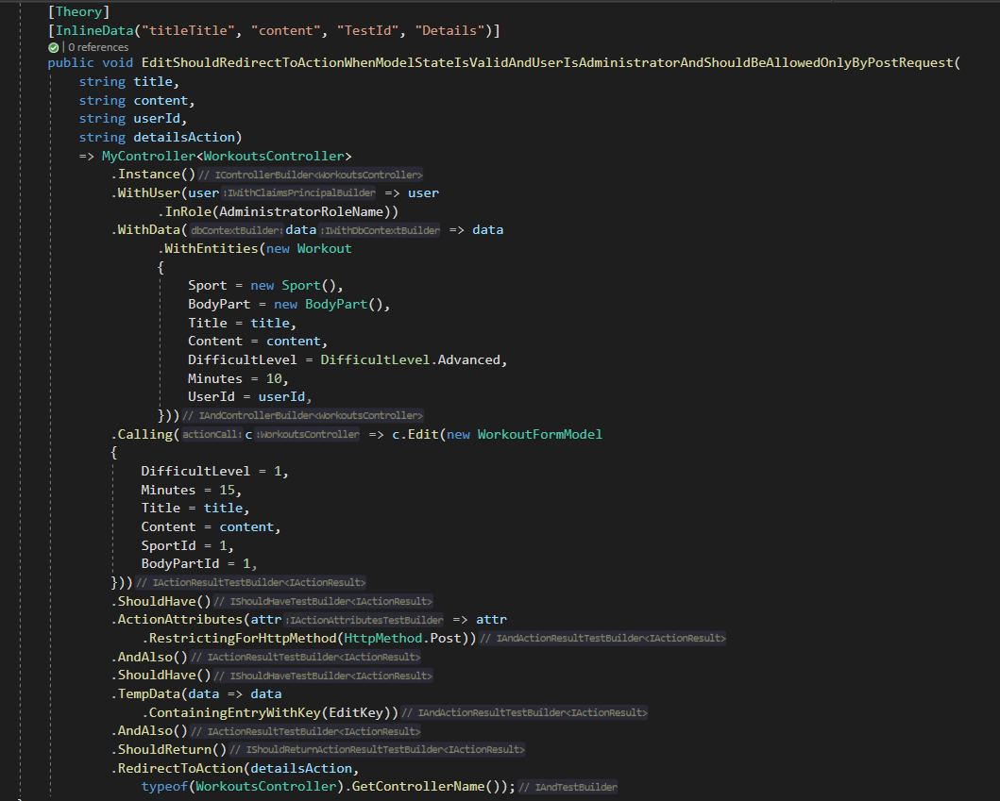
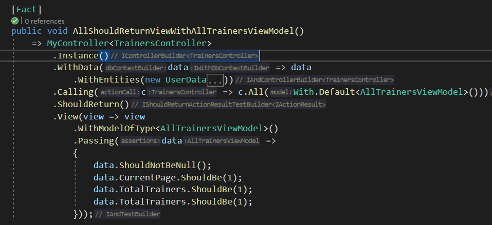
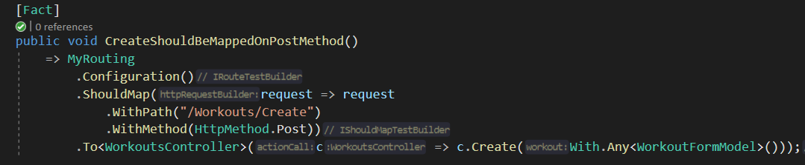
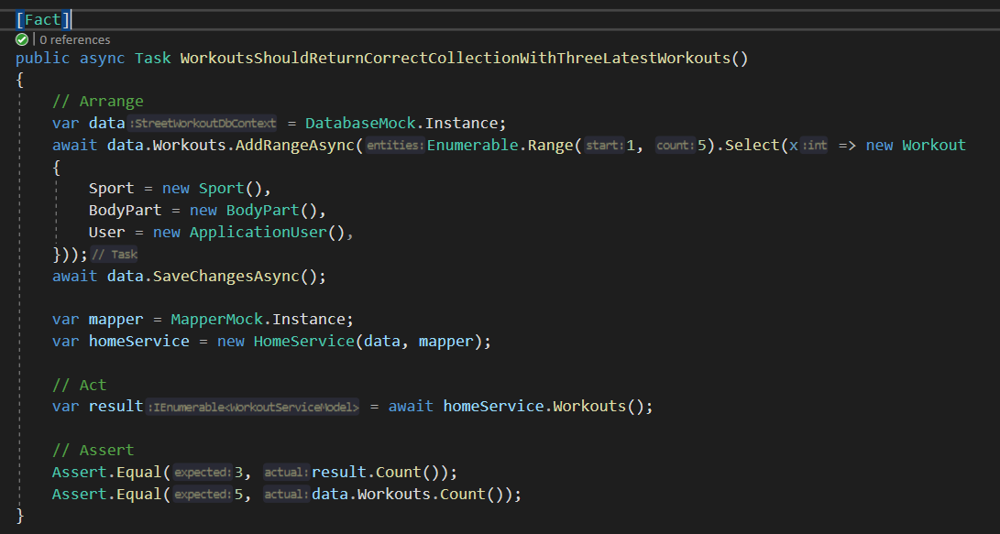

#  Street-Workout
ASP .NET Core MVC application designed to help people who are active in all sports.
<br />
Link of the Website - https://streetworkout.azurewebsites.net/

# Project Introduction
StreetWorkout is a ASP.NET Core MVC project I builded in course at SoftUni (April-June 2021). <br /> The website is application for people who are active in the sports. The Project follow the best practices for Object Oriented design and high-quality code for the Web application.

# Built With
* ASP.NET Core 5 MVC
* ASP.NET CORE view components
* ASP.NET Core areas
* MSSQL Server
* Entity Framework Core
* Auto-Mapper
* AJAX
* jQuery
* Moq
* XUnit
* Shouldly
* [MyTested.AspNetCore.Mvc](https://github.com/ivaylokenov/MyTested.AspNetCore.Mvc)
* Bootstrap
* Font Awesome Icons
* TinyMCE
* DataTables
* Moment.JS
* Lazy Kit (Bootstrap 4)

# Functionality
* Users Registration.
* Ability to registers in two roles, Trainer or Enthusiast.
* Every registered user has the opportunity to complete their account. This means to fill additional fields with data about them. Data like Training Frequency, Weight, Height...
* If user not completed their account they cannot use the full functionality of the application.
1. Trainers have the ability to create Workout, Group Workout also trainers can be Rated. They can also Edit or Delete their own workouts, group Workouts.
2. Both trainers and enthusiasts can.

    - View Workouts, Group Workouts and Supplements.
    - Rate the trainers.
    - Not rate themselves.
    - Use the Body Calculator. 
    - View trainers and the account of every registered user.
    - Comment on the workouts.
    - Buy tickets for group workouts.
* The system has a seeded administrator which can do everything like Both trainers and enthusiasts.
* The administrator can also Create, Edit or Delete everything in the application.
* Page about Workouts, that every registered user can view workout details, search by different criteria and learn interesting things.
* Page about Group Workouts with the same functionality as Workouts page.
* Page about Supplements with Create, Edit and Delete actions only for administrator.
* Page about Body Calculator with functionality to calculate how many calories you need per day to maintains your body weight, gain weight or lose weight.
* Cache Data 'Memory Cache' (see below) to reduce database queries.
* Interactive, flexible UX (User Experience)
* All of the payments on the website are fake.

# Project Architecture
* I use simple project architecture consisting of 5 projects.

1. StreetWorkout - ASP .NET Core Web App MVC.
2. StreetWorkout.Data - Class Library, holding DBContext, Migrations and DB-Models.
3. StreetWorkout.Services - Class Library, holding Services and Service Models.
4. StreetWorkout.ViewModels - Class Library, holding View Models.
5. StreetWorkout.Test - XUnit Test Project, holding Service and Controllers Tests.



# Quick Start && Implementation

* Administrator User - seeded by default and you can use it without making new registration if you want.
```javascript
UserName = Vasilkovski
Password = vasko123
```

* Cache - The latest workouts/users on the home page are cached with the purpose of reducing requests to the database.

```javascript
var latestWorkouts = this.cache.Get<IEnumerable<WorkoutServiceModel>>(LatestWorkoutsCacheKey);
if (latestWorkouts == null)
{
    latestWorkouts = this.homeService.Workouts();

    var cacheOptions = new MemoryCacheEntryOptions()
        .SetAbsoluteExpiration(TimeSpan.FromMinutes(10));

    this.cache.Set(LatestWorkoutsCacheKey, latestWorkouts, cacheOptions);
}
```

# Database Diagram



# Test
## Written Tests - 200
### Libraries used for testing:

* XUnit
* Moq
* [MyTested.AspNetCore.Mvc](https://github.com/ivaylokenov/MyTested.AspNetCore.Mvc)
* Shouldly

---

* Services Test Coverage 100%


* Controllers Test Coverage 100%


* Integration Test



* Routing Test


* Service Test


# Steps to create a similar web application from scratch:

1. Create and clean project.
2. Introduced data project and configure Database in it.
3. Extend default IdentityUser.
4. Implemented lazy kit theme.
5. Extend register form, create user role, gender and add validations.
6. Finished account complete functionality.
7. Implement service layer.
8. Separation of the application by projects.
9. Implemented a account page in which user data is visualized.
10. Implemented Account page and if user account is completed show user data or it is not completed, show account complete form.
11. Implemented a Trainers page in which all trainers will be visualized.
12. Implemented training creation.
13. Implemented group workouts, visualization and creation.
14. Implemented body calculator, which calculates how many calories you need per day.
15. Introduced Administartor area.
16. Cover services with unit tests.
17. Cover Controlles with integration tests.
18. Implemented page for supplements with Create, Edit and Delete actions.
19. Removed 'this' from all views.
20. Use TempData for messages after adding, editing and deleting new entity.
21. Impelemented searching of supplements.
22. Added documentation about project architecture.
23. Fixed footer.
24. Listed latest supplements at home page.
25. Added documentation about best practices and high quality code.
26. Test Routing and Logic of the controllers.
27. Implemented Administration on Supplement Categories.
28. Added Partial views where appropriate.
29. Separated OnModelCreating Configurations from DbContext.
30. Fixed UI of the administration page.
31. Implemented user payments statistics administration.
32. Introduced DataTables JS library.
33. Implemented a chat where all registered users can exchange messages in real time (using SignalR).
34. Added Momment.JS client library.
35. Introduced 'async && await' where is appropriate.
36. Fixed bug in Workouts/GroupWorkouts details with latest workouts route.
37. Implemented Checkout functionality of supplements.
38. Fixed content in home page.
39. Published Website in Azure App Service (Windows).
40. Removed magic strings.

Potential Tasks:
* Add column CreatedOn in ApplicationUser entity and order users on it.
* Add StyleCop.

# Note
ConnectionStrings:
* MacOs - Data Source=127.0.0.1,1433;Initial Catalog=StreetWorkout;User ID=sa;Password=<YourStrong@Passw0rd>;
* Windows - Server=.;Database=StreetWorkout;Trusted_Connection=True;MultipleActiveResultSets=true